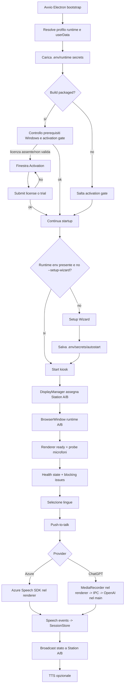
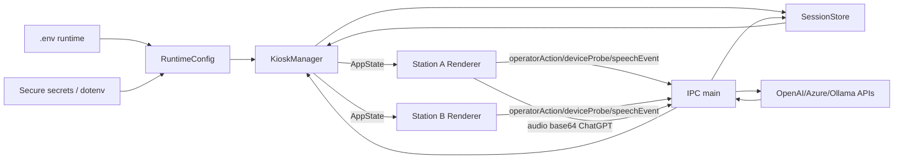
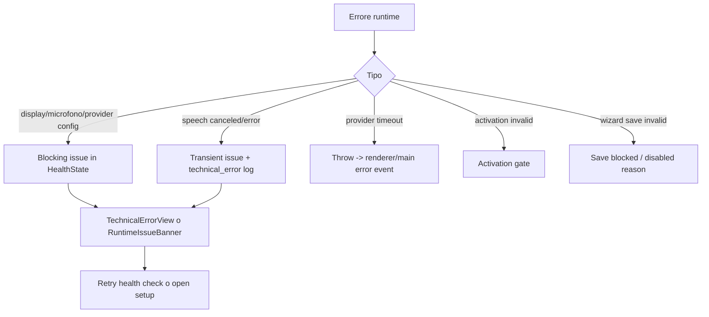

# OnlySpeech - Flusso reale dell'app

Audit eseguito sul codice locale Windows in `D:\GITHUB\OnlySpeech`. Questa ricostruzione deriva da `src/main/bootstrap.ts`, `src/main/ipc.ts`, `src/main/kiosk-manager.ts`, `src/main/kiosk-display-runtime.ts`, `src/services/*`, `src/renderer/operator/*`, `src/tools/setup-wizard/*` e `src/renderer/activation/*`.

## Schema generale

## Step-by-step

1. `bootstrap.ts` imposta nome app, path `userData/sessionData`, interpreta `--setup-wizard` e `--wizard-section`.
2. `loadRuntimeEnv()` fonde `.env` runtime e secure secrets, poi `loadRuntimeConfig()` normalizza la configurazione.
3. In packaged mode controlla prerequisiti Windows e activation. Se la licenza non passa, apre `ActivationWindow`.
4. Se activation passa e il runtime env esiste, crea `KioskManager`; altrimenti apre `SetupWizardManager`.
5. Il wizard gira su server locale `127.0.0.1` con finestre control/overlay, legge/scrive env, autostart, segreti e test provider.
6. Il kiosk crea due finestre renderer A/B quando trova display assegnabili.
7. I renderer inviano `renderer-ready`, fanno probe microfoni e ricevono stato tramite IPC.
8. L'utente seleziona le lingue; quando entrambi i side sono committed e non ci sono blocking issues, PTT diventa disponibile.
9. PTT Azure usa Speech SDK direttamente nel renderer con chiave passata dal main. PTT ChatGPT registra audio nel renderer, lo manda base64 al main, il main chiama OpenAI transcription + translation.
10. Risultati e stati passano a `SessionStore`, poi vengono broadcast a entrambe le finestre.
11. TTS opzionale puo sintetizzare nel main e riprodurre nel renderer, ma i comandi contengono anche credenziali provider.
12. Idle clear/hard reset cancellano stato conversazione e ricreano sessioni.

## Flusso dati

## Autenticazione e autorizzazione

Non esiste auth utente classica. Esistono tre gate:

- Activation packaged: token offline firmato Ed25519, stato locale persistito, revalidazione ogni 60 secondi in packaged mode.
- Trial: stato locale + tombstone HKCU `Software\OnlySpeech\Activation`.
- Setup wizard access: password workstation-local con hash scrypt e password temporanea iniziale.

Punti fragili: il trial e locale e modificabile; il wizard non ha rate limit; gli handler IPC wizard non verificano esplicitamente il mittente; i segreti provider sono esposti a renderer per alcune funzioni.

## Persistenza

Non ho rilevato database o migrazioni. Persistenza reale:

- Runtime `.env` nel runtime root.
- Secure secrets in file cifrato Electron safeStorage in packaged Windows.
- Activation state in `userData/config/activation-state.json`.
- Setup wizard access record in `userData/config`.
- Trial tombstone in HKCU Registry.
- Log JSONL in `userData/logs`.
- Artefatti packaging/commissioning sotto `artifacts/`.

## Errori e fallback

Fallback importanti:

- Config invalide spesso degradano ai default.
- In kiosk dual-dedicated con un solo microfono, il codice passa implicitamente a comportamento shared.
- ChatGPT partial audio viene degradato: niente parziali affidabili, final turn only.
- Se non ci sono display assegnati, finestre esistenti possono essere preservate.

## Integrazioni esterne

- Azure Speech SDK: STT live nel renderer e TTS tramite provider.
- Azure Translator: usato per normalizzazione playback Azure.
- OpenAI Chat Completions: traduzione ChatGPT.
- OpenAI Audio Transcriptions: STT ChatGPT.
- OpenAI TTS: playback ChatGPT.
- Ollama: traduzione/diagnostica, non live STT/TTS.
- Windows Registry: autostart HKCU e trial tombstone.
- Windows shutdown: comando `shutdown /s /t 0` in packaged mode.

## Stati principali

- Activation: `required`, `invalid-code`, `email-mismatch`, `expired-license`, `clock-rollback`, `invalid-state`, `trial-exhausted`.
- Side state: `booting`, `language-selection`, `ready`, `listening`, `translating`, `error`.
- Health: `displaysReady`, `microphonesReady`, `speechReady`, `translationReady`, `blockingIssues`.
- TTS: `idle`, `starting`, `playing`, `unavailable`, `error`.
- Reset/session: `idle-clear`, `hard-reset`, `language-change`.

## Assunzioni implicite nel codice

- Il renderer e sostanzialmente trusted, anche quando riceve segreti provider.
- La defaultSession Electron puo concedere media globalmente.
- Il fallback da due microfoni a un microfono e accettabile in kiosk.
- I valori config invalidi possono essere sostituiti dai default senza fermare la macchina.
- La prova live provider/hardware non e riproducibile dal solo repository.
- Il trial locale non deve resistere a un utente locale determinato.

## Punti fragili del flusso

- Security boundary main/renderer debole per segreti, sandbox e media permission.
- E2E non-Latin visitor attualmente fallisce; la superficie automation confonde Retry con Change language.
- Il gate packaging e obsoleto: si aspetta vulnerabilita che non ci sono piu.
- Non c'e database, ma ci sono molti stati locali non transazionali: env, secret file, activation file, registry, logs.
- Le integrazioni live hanno timeout, ma non hanno retry/backoff/idempotenza strutturata.
- Le prove piu importanti richiedono hardware e provider reali: senza quelle il flusso resta solo parzialmente dimostrato.
